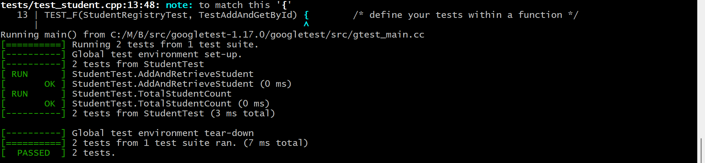

# 🧪 Keploy Session 5 – C++ Unit Test Generator

## 📚 Table of Contents

- [About Project](#about-project)
- [Installation](#installation)
- [Use / Run the Project](#use--run-the-project)
- [Features](#features)
- [Screenshot](#screenshot)
- [Contact Me](#contact-me)

## 📌 About Project

This repository is part of **Keploy API Fellowship – Session 5**.  
It demonstrates a **C++ Unit Test Generator** system using:

- GoogleTest framework
- Local LLM (`deepseek-coder` via Ollama)
- Custom YAML and text prompts
- Test automation with `g++` and `gcov` for coverage

The project focuses on generating, refining, and running unit tests on real C++ code using LLMs and open-source tools.

## ⚙️ Installation

### 1. Clone the repository:

```bash
git clone https://github.com/anandsundaramoorthysa/Keploy-Session5-CPP-Test.git
cd Keploy-Session5-CPP-Test
````

### 2. Install requirements:

* Install **MSYS2** from [https://www.msys2.org](https://www.msys2.org)
* Open MSYS2 **UCRT64** terminal and run:

```bash
pacman -Syu
pacman -S mingw-w64-ucrt-x86_64-gcc mingw-w64-ucrt-x86_64-gtest
```

* Install Python libraries:

```bash
pip install pyyaml
```

* Run Ollama & pull LLM model:

```bash
ollama pull deepseek-coder
```

## 🚀 Use / Run the Project

### 1. Generate Unit Tests using LLM:

```bash
python generate_tests.py
```

This uses:

* `prompts/student_prompt.yaml`
* `prompts/initial_prompt.txt`
* `src/student.cpp`

It generates:

* `tests/test_student.cpp`

### 2. Compile and Run the Test Binary:

```bash
g++ -std=c++17 tests/test_student.cpp src/student.cpp -o student_test.exe -lgtest -lgtest_main -lpthread
./student_test.exe
```

## ✨ Features

* ✅ GoogleTest-based unit testing
* ✅ YAML + natural language prompts for test generation
* ✅ Compatible with `deepseek-coder` via Ollama
* ✅ Coverage-ready with `gcov`
* ✅ Lightweight, offline-friendly development

## 🖼️ Screenshot

Test result output:



## 📬 Contact Me

If you have any questions, ideas, or would like to collaborate on future AI + Testing projects, feel free to reach out:

* 📧 **Email**: [sanand03072005@gmail.com](mailto:sanand03072005@gmail.com?subject=Inquiry%20about%20C++%20Unit%20Test%20Generator%20Project&body=Hi%20Anand%2C%0A%0AI%20found%20your%20Keploy%20Session%205%20project%20interesting%20and%20I%27d%20like%20to%20learn%20more%20about%20how%20you%27ve%20used%20LLMs%20and%20GoogleTest%20for%20unit%20test%20automation.%20Looking%20forward%20to%20connect.%0A%0AThanks!%0A%0A%5BYour%20Name%5D)
* 💼 **LinkedIn**: [Anand Sundaramoorthy](https://www.linkedin.com/in/anandsundaramoorthysa/)

